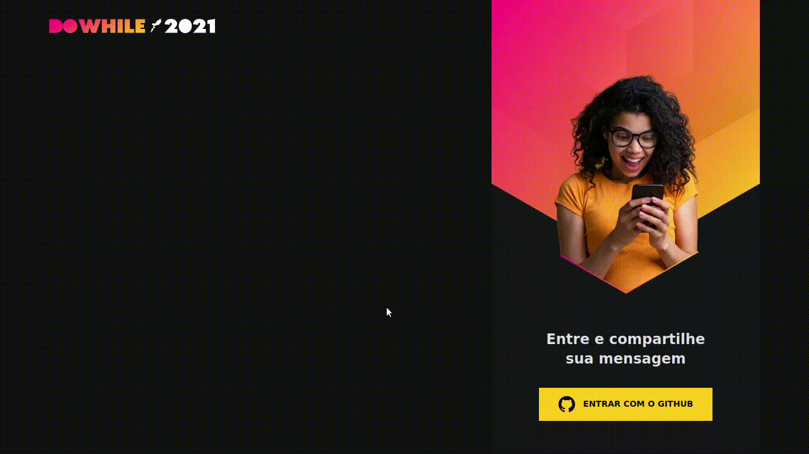

# NLW Heat Web

Aplicação React com TypeScript criada durante o NLW Heat da Rocketseat.

* [Tecnologias](#-tecnologias)
* [Como executar](#-como-executar)
* [Licença](#-licença)

 

## ✨ Tecnologias

Esse projeto foi desenvolvido com as seguintes tecnologias:

* [React](https://reactjs.org/)
* [TypeScript](https://www.typescriptlang.org/)
* [Socket.IO](https://socket.io/)

## 🚀 Como executar

Observação: Nesse projeto temos autenticação via OAuth com o GitHub e depende da [API Node.js](https://github.com/ricardospalves/nlw-heat-api) para funcionar corretamente.

* Clone o repositório e acesse a pasta;
* Rode a [API Node.js](https://github.com/ricardospalves/nlw-heat-api) (leia o README.md do repositório);
* Faça uma cópia do arquivo **.env.example** para **.env.local** e preencha com as suas credenciais do GitHub;
* Instale as dependências com `npm install`;
* Inicie a aplicação com `npm run dev`.

A aplicação pode ser acessada em [http://localhost:3000](http://localhost:3000).

## 📄 Licença

Esse projeto está sob a licença MIT. Veja o arquivo [LICENSE](LICENSE) para mais detalhes.

---

Feito com ♥ by Rocketseat 👋 [Participe da nossa comunidade!](https://discordapp.com/invite/gCRAFhc).
